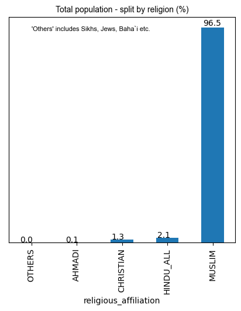
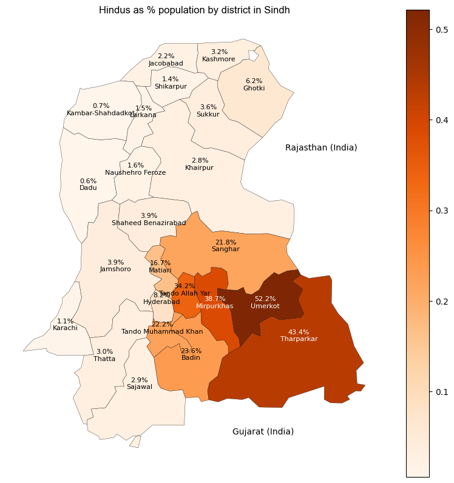

#### || Shree Ganeshaya Namaha ||

# State of minorities in Pakistan
An analysis on the state of minorities of Pakistan - through data analysis

## Data  

#### 1. Population data. 
Due to credits to `colincookman` for his great work in processing and cleaning the census data available from the government website - Pakistan Bureau of Statistics<a href="https://www.pbs.gov.pk/">1</a>. You can access the code and data for obtaining the cleaned dataset through `colincookman`'s repo here: <a href="https://github.com/colincookman/pakistan_census">https://github.com/colincookman/pakistan_census</a>. 
  
#### 2. Shape data
Shapefiles for districts was downloaded from: <a href="https://carto.com/dataset/pakistan_districts">https://carto.com/dataset/pakistan_districts</a>

----  

## Methodology  

The following cleaning steps were taken for this analysis:
1. Data for the following districts was merged to get data for `Karachi district`:  
  * Karachi Central
  * Karachi East
  * Karachi South
  * Karachi West
  * Korangi
  * Malir. 
  
2. Populations of `HINDU` and `SCHEDULED CASTES` was combined to get teh true Hindu population. For the census, Dalits were given an option to choose between one: scheduled caste or Hindu. Dailts are a part of the Hindu fold and for the purpose of this analysis, we combined both the populations. To read more about the gaps in the census, you can check this article by <a href="https://opindia.com/>OpIndia</a> <a href="https://www.opindia.com/2017/03/pakistan-declares-dalits-as-different-religion-from-hinduism-in-their-census/"> here </a>.  

3. Non-muslim population by adding together populations belonging to the following groups:
  * `AHMADI` - Ahmadiyyas are not considered Muslims in Pakistan.
  * `CHRISTIAN`
  * `HINDU_ALL` - includes `HINDU` and `SCHEDULED CASTES`
  * `OTHERS` - this includes Sikhs (yes, Sikhs were not identified as a separate religion). A break-up of Sikh population was not available.
  
4. Some other cleaning stpes include making district names consistent (for Sindh), for e.g. `Kambar-Shahdadkot` <--> `Kambar Shahdad Kot`. This was done in order to join shape-file data with population data.

---  
  
## Analysis

### 1. ~97% of population follows Islam  
  

### 2. 94% of Hindus in Pakistan live in Sindh; most of the Hindu population in concentrated in some specific districts
For the purpose of analysis, we selected a set of districts that have relatively high population of Hindus:  
* Tharparkar 
* Umerkot 
* Badin 
* Tando Muhammad Khan 
* Tando Allah Yar 
* Mirpurkhas 
* Sanghar 
* Matiari
  

### 3. Sikhs are not identified as a separate religion in the census

### 4. Hindu populations in Sindh are at the target of forced conversion groups

References / links:
1. Pakistan Bureau of Statistics: https://www.pbs.gov.pk/, last accessed on January 29, 2023
